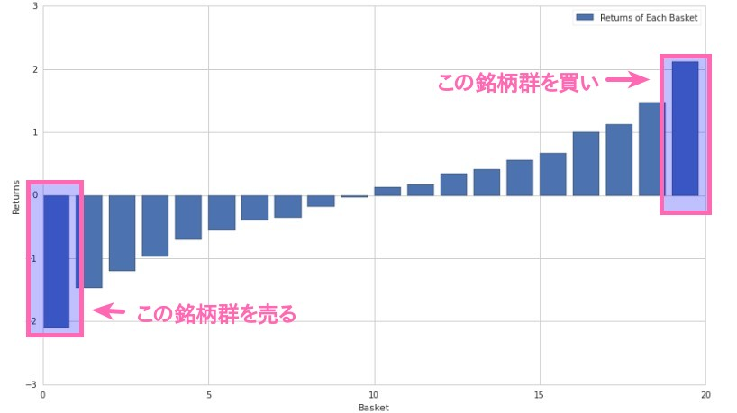
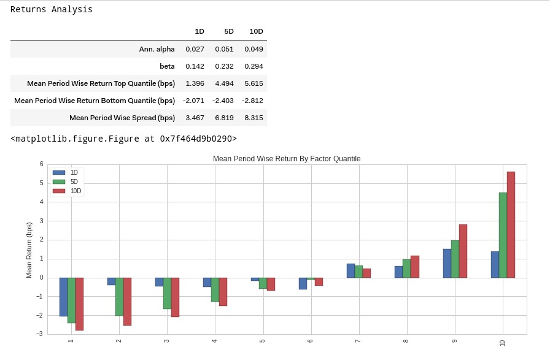
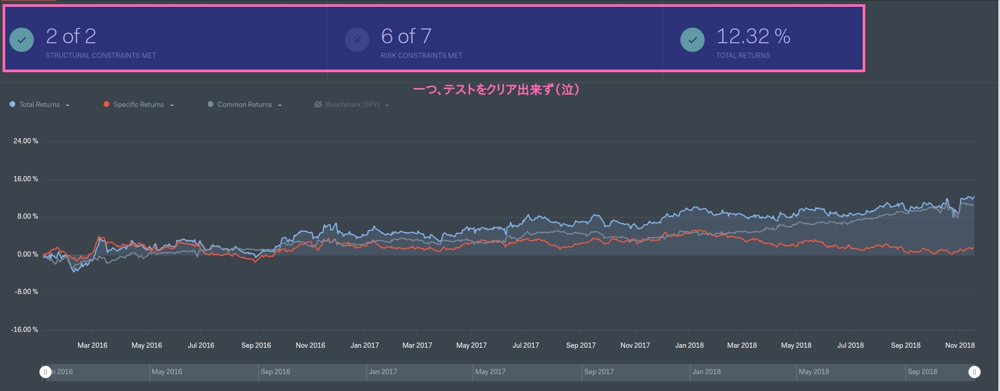
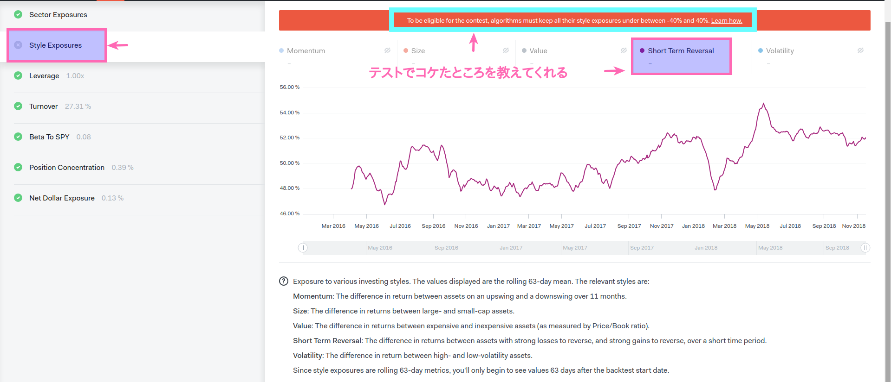
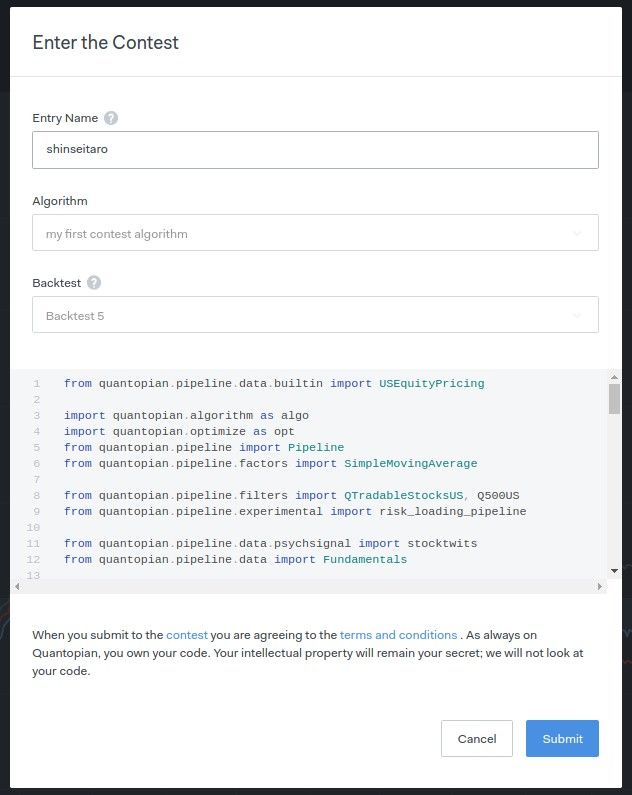

@snap[midpoint]
## Quantopian Contest に 応募してみた
@snapend

---

## 自己紹介と注意事項

+ @shinseitaro / 早起きトレーダー
+ 顔写真はNG
+ スライドはシェアOK

---

## Quantopian Contest について

+ [contest 概要](https://www.quantopian.com/contest)
+ [翻訳しました](https://qiita.com/shinseitaro/items/d53c83ed725873f05274)

---

## 応募条件

### **cross-sectional, long-short equity strategies**

ユニバースに入っている銘柄をランキングし、

一番高いランキングの銘柄群を買い、

一番低いランキングの銘柄群を売る。

（ショートロングの方向に気をつける）

---

## コンテストのカギ

### **predictive ranking scheme** を見つけること

---

## アルゴリズムの条件

+ Postive Return
+ レバレッジは0.8〜1.1倍以内
+ 特定の銘柄に偏っていない
+ low beta to SPY
+ 全投資資金とポートフォリオ価値の割合規制
+ 流動性が十分ある銘柄
+ セクター分散
+ スタイルファクターに対して低リスク
+ Optimize APIを使って注文

---

## 今回の目標

### **条件のクリア**と**コンテストへの参加**

（いい成績なんてムリ！）

---

## それなりのalphaを見つける

ロングショートでセクター分散

↓

平均からの乖離（甘い考えだった）

---

### イメージ

---

## Research

+ Alphalens
+ [オープンソース](https://github.com/quantopian/alphalens)
+ **performance analysis of predictive (alpha) stock factors**
+ Quantopian Research上でファクターを分析

---

---

@snap[midpoint]
## @fa[smile-o fa-5x]
@snapend

---

## Algorithm

+ 条件を満たすようなアルゴリズムを1から書くのはかなり厳しい（関数の使い方とか）
+ テンプレがある@fa[heart]
+ [Example: Long-Short Equity Algorithm](https://www.quantopian.com/lectures/example-long-short-equity-algorithm)
+ (書いたストラテジーはnoteで公開します。)

---

## backtest

---

## どこで落ちた?

---

## Short Term Reversal

@size[0.5em](The short-term reversal factor captures the difference in returns between stocks with strong recent losses theoretically primed to reverse ,recent loser stocks, and stocks with strong recent gains theoretically primed to reverse ,recent winner stocks, in a short time period.)

---

@snap[midpoint]

@snapend

---

@snap[midpoint]
## やっちゃダメな戦略だった
@snapend

---

## どうしよう。。。

+ 色々悩む（1日半くらい）
+ 時間がない
+ 移動平均の `window=` を20日から60日に長くしてみたらなんとなくクリア。

---

## オールグリーン

---

## submit

@snap[west span-40]
@ul
- submit 時に名前を聞かれる。
- サブミットした次の日のデータで最終テスト
- 合格、不合格はメールでお知らせ
- 2018/11/30現在まだメールきてない
@ulend
@snapend

@snap[east span-40]

@snapend

---

## 感想

+ Quantopianの哲学
+ Forum で `Algo Template` `Contest`
+ ファンダメンタルアルゴリズム
+ Quantopian Risk Modelの理解
+ 学生さんのみ対象のContest

---

## おしらせ

+ [Tokyo Quantopian User Group Vol.06 Factor Model - connpass](https://quantopian-tokyo.connpass.com/event/105587/)

+ note https://note.mu/notes/nc229144d5f76/edit
